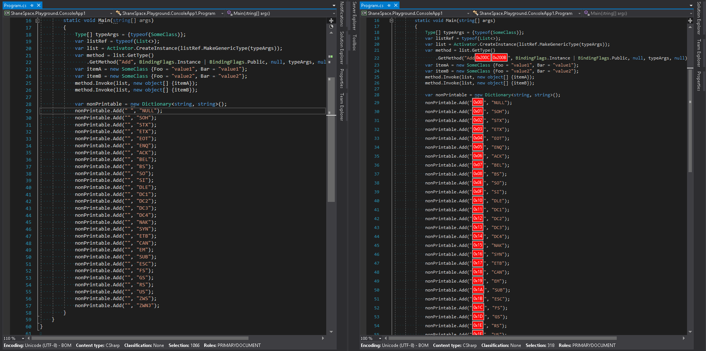

Invisible Character Visualizer Visual Studio Extension
======================================================

Visual Studio Gallery
----------------------
https://marketplace.visualstudio.com/items?itemName=ShaneRay.InvisibleCharacterVisualizer

Motivation
----------
I ran into an issue where some code was not running as expected.  I hopped on StackOverflow and posted my question.

https://stackoverflow.com/questions/42423320/getmethod-returning-null

The question was quickly answered.  The issue ended up being an "Invisible" character hidden away in my string.  I had ran into this problem before and did not want to run into it again, so I created this extension.

With this extension it is very easy to spot "Invisible" characters that may be unwanted.

Screenshot
-------------------
